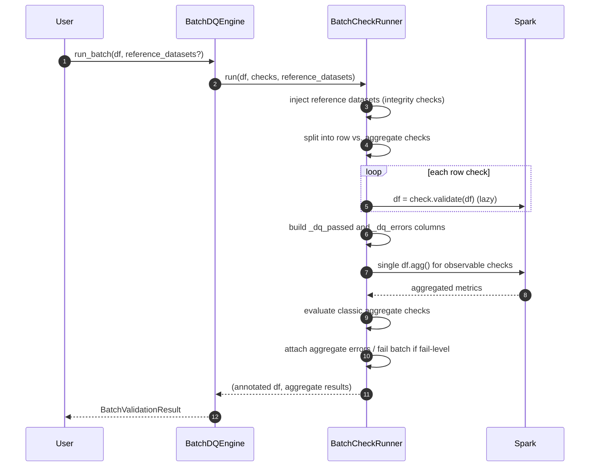

# Execution Flow

A batch validation is a two-phase process over a single logical pass of the
data: row-level checks are composed as lazy column transformations, and
aggregate checks are collapsed into as few Spark actions as possible.

`BatchDQEngine` (`engine/batch/dq_engine.py`) is the entry point. It is
constructed with a `CheckSet` and `fail_levels` (default `[Severity.CRITICAL]`)
and delegates to `BatchCheckRunner`.

## Steps in detail

`BatchCheckRunner.run()` (`engine/batch/check_runner.py`):

1. **Inject reference datasets.** Every check implementing `IntegrityCheckMixin`
   receives the named reference DataFrames. Checks without the mixin are skipped.
2. **Partition checks** into row-level (`BaseRowCheck`) and aggregate-level
   (`BaseAggregateCheck`).
3. **Apply row checks** in sequence. Each `validate()` appends its boolean
   column. For every check the runner records a `struct(check, check-id,
severity)` and, if the check's severity is in `fail_levels`, a fail flag.
4. **Compute `_dq_passed`.** The fail flags (checks whose severity is in
   `fail_levels`) are OR-ed and negated: a row passes iff none of its
   fail-level checks fired. With no such checks, all rows pass.
5. **Build `_dq_errors`.** The per-check error structs are collected into an
   array and filtered to the entries that actually fired for each row, so a
   passing row carries an empty array rather than a list of nulls.
6. **Evaluate aggregate checks.** Observable checks are batched into a **single**
   `df.agg()` call; classic checks are evaluated individually. Results are
   re-ordered to match the original declaration order.
7. **Attach aggregate outcomes.** Failed aggregates are concatenated onto
   `_dq_errors`. If any failed aggregate has a severity in `fail_levels`, **every
   row** is set to `_dq_passed = False` — a dataset-level breach fails the batch
   as a whole, because the offending rows cannot be localized.

The runner returns the annotated DataFrame and the ordered list of
`AggregateCheckResult`; the engine wraps both in a `BatchValidationResult`.

## Semantics worth noting

- **Order independence for row checks.** Row checks only add columns, so their
  relative order does not change the outcome. Aggregate results, by contrast, are
  explicitly restored to declaration order for stable reporting.
- **Warnings never fail rows (by default).** Under the default
  `fail_levels=[CRITICAL]`, a `WARNING` check contributes to `_dq_errors` but is
  never added to the fail flags, so it cannot flip `_dq_passed`. This is what
  makes the `warn_df()` view (passed rows carrying warnings) meaningful. A caller
  that puts `WARNING` in `fail_levels` changes this — see the
  [Output Model](output_model.md).
- **Laziness, then forced aggregate actions.** Row-check composition only builds
  up a query plan; nothing runs yet. The aggregate phase is what first forces
  execution — the batched observable `df.agg().first()`, plus one action per
  classic aggregate check — all against the _original_ input DataFrame. The
  annotated DataFrame itself stays lazy until a view is materialized, so callers
  that derive several views should cache it (`result.df.cache()`).
