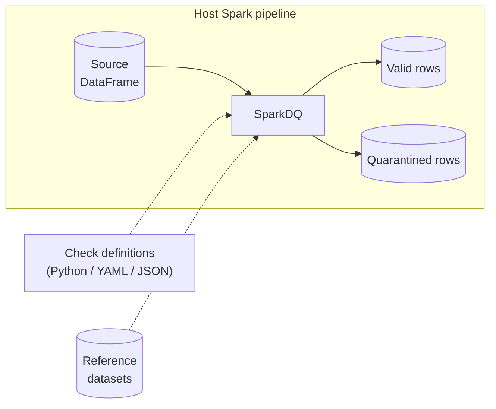
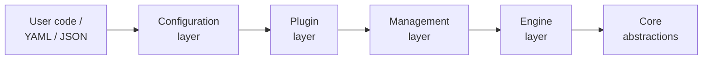

# Overview

SparkDQ is a declarative framework for row- and aggregate-level data quality
validation on Apache Spark. This section documents its internal architecture for
contributors and for users who need to understand how the framework behaves
beneath the public API — the building blocks, the contracts between them, and
the path a validation takes from a declarative definition to an annotated Spark
DataFrame.

This page establishes the system context and the layered model. The pages that
follow drill into the [core abstractions](core_abstractions.md), the
[execution flow](execution_flow.md), and the [output model](output_model.md).
The reasoning and trade-offs behind each structural choice are collected under
[Design Decisions](design_decisions.md).

## System context

SparkDQ sits inside a Spark pipeline as a library, not as a service. It takes a
DataFrame the pipeline already holds, evaluates it against a set of checks, and
returns the same data annotated with the outcome — with no external
infrastructure, no network calls, and no wrapping of the surrounding job.



Its runtime footprint is deliberately small. The core depends only on **Pydantic
2.x**; PySpark (**3.5.x**, Python **≥ 3.11**) is expected to be supplied by the
host platform — typically a managed environment such as Databricks — rather than
bundled, which avoids version conflicts with the cluster runtime.

## Design goals

The architecture is shaped by a small number of goals that recur throughout the
[design decisions](design_decisions.md):

- **Declarative.** A check is data, not code. Rules can be authored in Python or
  in YAML/JSON and validated before any Spark job runs.
- **Extensible without forking.** New checks are added by registration, never by
  editing the framework core.
- **Single-pass and cost-aware.** Row checks compose into one query plan, and
  aggregate checks are batched into as few Spark actions as possible.
- **Traceable results.** Every verdict stays attached to the row it describes, so
  outcomes can be routed and audited directly.

## Layered model

SparkDQ is organized into layers with a strict, one-directional dependency rule:
each layer depends only on the ones beneath it. This keeps the check catalogue,
the configuration system, and the execution engine independently evolvable — a
new check touches only the top layers, and a change to the engine cannot ripple
up into check definitions.



| Layer                   | Module                     | Responsibility                                                                                                         |
| ----------------------- | -------------------------- | ---------------------------------------------------------------------------------------------------------------------- |
| User code / YAML / JSON | —                          | Check definitions, reference datasets, and the DataFrame to validate.                                                  |
| Configuration           | `sparkdq.core.base_config` | Pydantic `*Config` classes validate parameters and build check instances.                                              |
| Plugin                  | `sparkdq.plugin`           | `CheckConfigRegistry`, `CheckFactory`, and `@register_check_config` resolve a check name to a config class to a check. |
| Management              | `sparkdq.management`       | `CheckSet` collects and groups checks into row- and aggregate-level sets.                                              |
| Engine                  | `sparkdq.engine`           | `BatchDQEngine` drives `BatchCheckRunner` and returns a `BatchValidationResult`.                                       |
| Core abstractions       | `sparkdq.core`             | `BaseCheck`, `BaseRowCheck`, `BaseAggregateCheck`, `ObservableAggregateCheck`, `IntegrityCheckMixin`, `Severity`.      |

## End-to-end walkthrough

The layers connect into a single flow. The example below is intentionally
minimal; each numbered step maps to one layer above.

```python
from sparkdq.checks import NullCheckConfig, RowCountMinCheckConfig
from sparkdq.engine import BatchDQEngine
from sparkdq.management import CheckSet

# 1. Configuration — declare checks as validated config objects.
check_set = (
    CheckSet()
    .add_check(NullCheckConfig(check_id="email-not-null", columns=["email"]))
    .add_check(RowCountMinCheckConfig(check_id="min-rows", min_count=1000))
)

# 2. Engine — bind the checks to an engine and run against a DataFrame.
result = BatchDQEngine(check_set).run_batch(df)

# 3. Output — act on the annotated result.
result.pass_df().write.saveAsTable("clean")
result.fail_df().write.saveAsTable("quarantine")
```

1. **Configuration & plugin.** Each `*Config` validates its parameters through
   Pydantic and builds a check instance. Had the checks been supplied as
   dictionaries (from YAML/JSON), the plugin layer would have resolved each
   `check` name to its config class first.
2. **Management & engine.** `CheckSet` groups the checks; `BatchDQEngine` hands
   them to `BatchCheckRunner`, which applies row checks as lazy column
   transformations and batches the aggregate checks into a single `df.agg()`.
3. **Output.** `run_batch()` returns a `BatchValidationResult` whose views —
   `pass_df()`, `fail_df()`, `warn_df()`, `summary()` — are derived from the
   `_dq_*` metadata columns written onto the DataFrame.

## Where to go next

| Page                                      | Scope                                                                                                                       |
| ----------------------------------------- | --------------------------------------------------------------------------------------------------------------------------- |
| [Core Abstractions](core_abstractions.md) | The base-class contracts and the configuration, plugin, and management layers that turn a definition into a runnable check. |
| [Execution Flow](execution_flow.md)       | The step-by-step behaviour of `run_batch()`, with a sequence diagram.                                                       |
| [Output Model](output_model.md)           | The `_dq_*` metadata columns and the result views built on them.                                                            |
| [Design Decisions](design_decisions.md)   | The rationale, benefits, and trade-offs behind each structural choice.                                                      |
