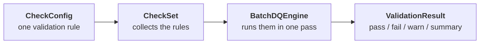

# Introduction

SparkDQ follows a simple idea: you describe what valid data looks like, and the framework checks it for you — directly inside your Spark pipeline.

## Deliberately small

SparkDQ's defining trait is what it leaves out. It is intentionally small in scope and low in complexity: a focused set of row- and aggregate-level checks, a declarative configuration layer, and a single-pass engine — and little else. There is no metadata store, no orchestration layer, no profiling engine, and no data-docs pipeline to operate. You can read and understand the whole framework in an afternoon.

That smaller surface is a design choice, not a limitation to apologize for. It means fewer moving parts to learn, fewer ways to misconfigure, and a codebase that stays easy to extend and maintain. For the large majority of pipelines — where the job is to enforce a known set of rules and route good and bad records accordingly — this is exactly enough, and the reduced complexity is a feature in itself.

It is honest about where it stops: if you need automated data profiling, statistical anomaly detection, or a full data-quality platform with its own UI and storage, a heavier tool is the better fit. SparkDQ trades that breadth for clarity.

## How it fits into your pipeline

SparkDQ is built for data engineers who work with PySpark and want a lightweight, non-invasive way to enforce data quality. There is no extra infrastructure, no external services, and no wrappers around your existing code. It runs alongside your pipeline, validates a DataFrame in a single pass, and returns a structured result you can act on — stop the pipeline, route bad records to a quarantine zone, or simply log what went wrong.

## Core concepts

Four building blocks compose into one flow:



- **CheckConfig** — a single validation rule, such as "this column must not be null" or "the row count must be at least 1,000". Each rule has its own typed, validated config class.
- **CheckSet** — the collection of configs and the single source of truth for one validation run.
- **BatchDQEngine** — takes the CheckSet and a Spark DataFrame, applies every rule in a single pass, and produces the result.
- **ValidationResult** — a structured object with filtered views of passed, failed, and warning-level records, plus summary statistics like pass rate.

## A scenario to follow

The rest of this guide validates one small `orders` dataset end to end, enforcing three rules:

| Rule                              | Check type | Severity   |
| --------------------------------- | ---------- | ---------- |
| `customer_email` must not be null | row-level  | `CRITICAL` |
| `amount` must be greater than 0   | row-level  | `CRITICAL` |
| at least 100 rows per batch       | aggregate  | `WARNING`  |

The dataset contains one violation of each rule, so every result view has something to show:

```python
df = spark.createDataFrame([
    {"order_id": 1, "customer_email": "alice@example.com", "amount": 42.0},
    {"order_id": 2, "customer_email": None,                "amount": 19.5},
    {"order_id": 3, "customer_email": "carol@example.com", "amount": -5.0},
])
```

Next: [define these checks](defining_checks.md).
